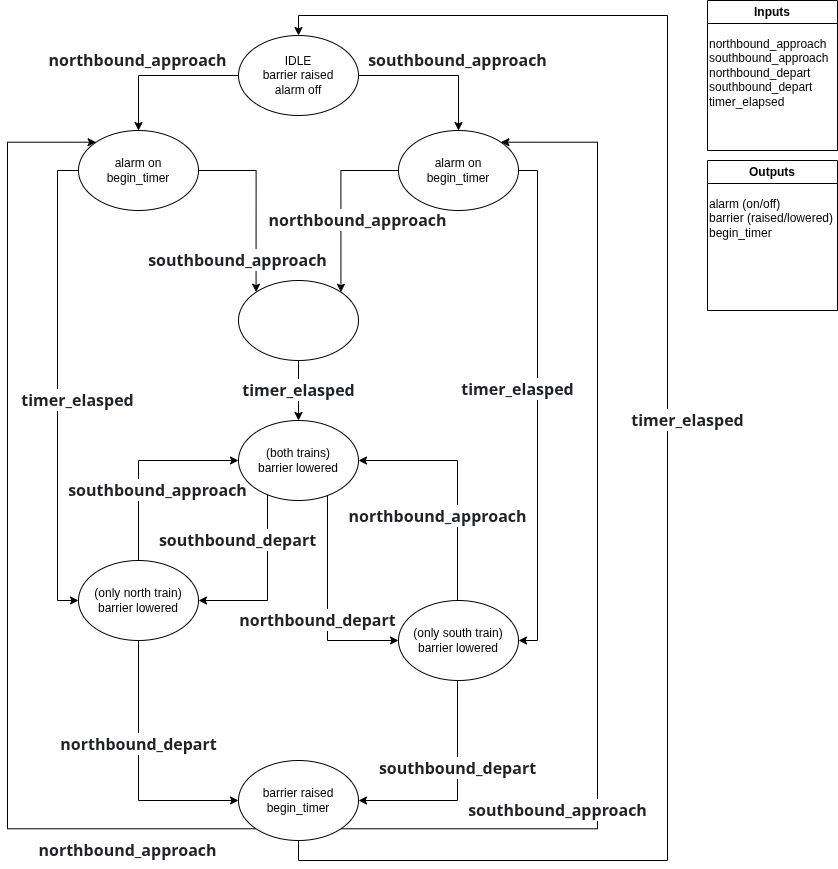

# Lab 9 Verification

## Invariants
Here is the list of invariants we came up with for the Dual Railroad Problem:

1. Alarm always preceeds the arms lowering
1. The approach signal always activates before the departure signal (for a single direction)
1. Arms always lower before the train passes 
1. Arms lowering time is consistent
1. Alarm is always on when the train is present
1. Power is never interrupted
1. Weather will never damage the equipment
1. Only one train can be present at a time (for a single direction)
1. The alarm pnly activates when a train is approaching

## Varying invariants
One counter example that we found that invalidates the example_FSM is:

## Check Your Work
Tyler's FSM: no counter examples were found with Tyler's FSM

Timothy's FSM: 

(insert FSM)

## Prove it

| number | arms_down | alarm_on | northbound_present | southbound_present | north_approach | south_approach | north_depart | south_depart | timer_elasped | safety_hazard |
|--------|-----------|----------|--------------------|--------------------|----------------|----------------|--------------|--------------|---------------|---------------|
| 0      | 0         | 0        | 0                  | 0                  | 6              | 5              | 17           | 17           | 0             |               |
| 1      | 0         | 0        | 0                  | 1                  |                |                |              |              |               | 20            |
| 2      | 0         | 0        | 1                  | 0                  |                |                |              |              |               | 20            |
| 3      | 0         | 0        | 1                  | 1                  |                |                |              |              |               | 20            |
| 4      | 0         | 1        | 0                  | 0                  | 6              | 5              | 17           | 17           | 0             |               |
| 5      | 0         | 1        | 0                  | 1                  | 7              | 23             | 17           | 18           | 13            |               |
| 6      | 0         | 1        | 1                  | 0                  | 23             | 7              | 18           | 17           | 14            |               |
| 7      | 0         | 1        | 1                  | 1                  | 23             | 23             | 18           | 18           | 15            |               |
| 8      | 1         | 0        | 0                  | 0                  |                |                |              |              |               | 16            |
| 9      | 1         | 0        | 0                  | 1                  |                |                |              |              |               | 16            |
| 10     | 1         | 0        | 1                  | 0                  |                |                |              |              |               | 16            |
| 11     | 1         | 0        | 1                  | 1                  |                |                |              |              |               | 16            |
| 12     | 1         | 1        | 0                  | 0                  |                |                |              |              |               | 24            |
| 13     | 1         | 1        | 0                  | 1                  | 15             | 23             | 17           | 4            | 13            |               |
| 14     | 1         | 1        | 1                  | 0                  | 23             | 15             | 4            | 17           | 14            |               |
| 15     | 1         | 1        | 1                  | 1                  | 23             | 23             | 13           | 14           | 15            |               |

| number | invariant |
|--------|-----------|
| 16     | Alarm always preceeds the arms lowering          |
| 17     | The approach signal always activates before the departure signal (for a single direction)         |
| 18     | Arms always lower before the train passes         |
| 19     | Arms lowering time is consistent         |
| 20     | Alarm is always on when the train is present         |
| 21     | Power is never interrupted         |
| 22     | Weather will never damage the equipment         |
| 23     | Only one train can be present at a time (for a single direction)         |
| 24     | The alarm pnly activates when a train is approaching         |

## Specification vs. implementation
We created an FSM based on the table

(insert FSM)

Is your new FSM equivalent to the FSMs from the previously steps?
Yes, it actually was equivalent to Tyler's FSM (even down to having the same number of states in the FSM).
On the other hand, Timothy's FSM had fewer states, but more complicated logic on the state transitions between the states.
Timothy also had to introduce a new variable, Train_Count (T_c), to capture the nuances of 
At the end of the day, both the state machine derived from the table (equivalent to Tyler's FSM) and Timothy's FSM both are valid.
However, we came to the conclusion that Tyler's FSM is probably more readable for this problem, which we think is important in dealing with verification.

